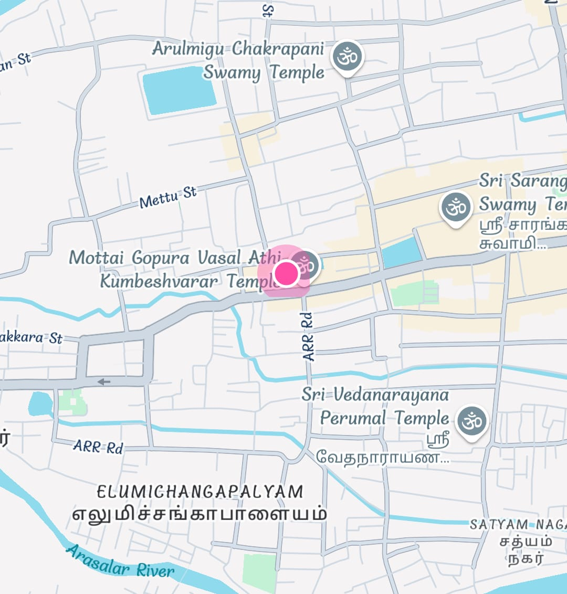

# EV Charger Locator App ⚡📍

A beautifully designed React Native app that displays nearby EV charging stations on a map, allows users to search for compatible chargers, capture screenshots of the map, and upload them directly to Google Drive.

---

## 🚀 Features

- 🔍 Search bar for filtering charging stations
- 🗺 Interactive map view with glowing current location
- 📌 Markers for multiple charger types
- 💾 Capture and save map screenshots
- ☁️ Upload screenshots to Google Drive via OAuth
- 📱 Styled info cards with charger details and distance

---

## 📸 Screenshot

---

## 🧰 Tech Stack

- **React Native (Expo)**
- **React Native Maps**
- **Expo Location**
- **react-native-view-shot**
- **Expo Auth Session (OAuth 2.0 with Google)**
- **Google Drive API**
- **Expo MediaLibrary**

